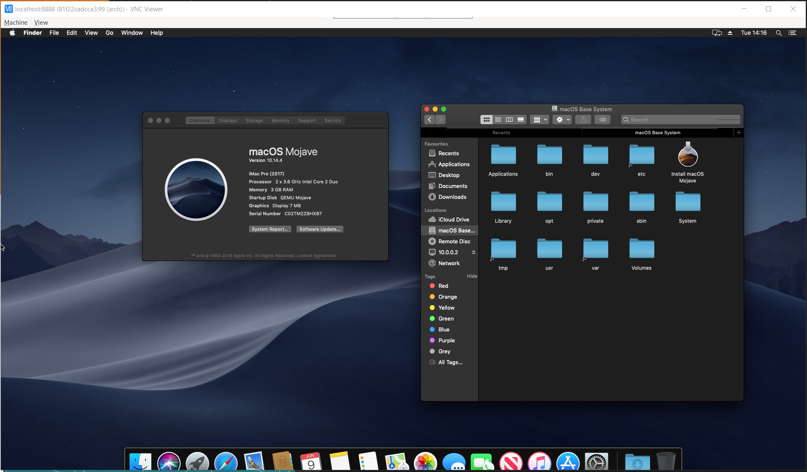

# osx in docker

Run headless container. Connect via VNC.

```
docker build -t osx .
docker run --name osx-in-docker -p 5901:5901 -d --privileged --cap-add=ALL -v /lib/modules:/lib/modules -v /dev:/dev osx
```



# Persistent volume

Maybe you want to keep your data outside of container.

## Create HDD first

Before initial run, you can create your HDD outside container. As argument, specify size of new HDD.

```
docker build -t osx-hdd -f hdd.Dockerfile .
docker run --rm -v $PWD:/data osx-hdd 128G
```

## Get HDD from container

You started first container without persistency keeping in mind? We've got you covered! Run container only as `/bin/bash` so we can get data from it. This ensures, that no data will be written to disk while copying.

```
docker run --name osx-in-docker --rm osx /bin/bash
docker cp osx-in-docker:/home/arch/OSX-KVM/mac_hdd_ng.img mac_hdd_ng.img
```

## Run container with persistent volume

When we have our `mac_hdd_ng.img` outside of container, we can run it like this:

```
docker run --name osx-in-docker -p 5901:5901 -d --privileged --cap-add=ALL -v /lib/modules:/lib/modules -v /dev:/dev -v $PWD/mac_hdd_ng.img:/home/arch/OSX-KVM/mac_hdd_ng.img osx
```

Inspired by:
* https://github.com/sickcodes/Docker-OSX
* https://github.com/kholia/OSX-KVM
* https://artem.services/?p=752&lang=en

### Is This Legal?

The "secret" Apple OSK string is widely available on the Internet. It is also included in a public court document [available here](http://www.rcfp.org/sites/default/files/docs/20120105_202426_apple_sealing.pdf). I am not a lawyer but it seems that Apple's attempt(s) to get the OSK string treated as a trade secret did not work out. Due to these reasons, the OSK string is freely included in this repository.

Gabriel Somlo also has [some thoughts](http://www.contrib.andrew.cmu.edu/~somlo/OSXKVM/) on the legal aspects involved in running macOS under QEMU/KVM.
